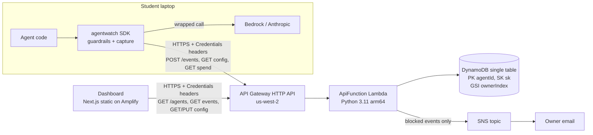
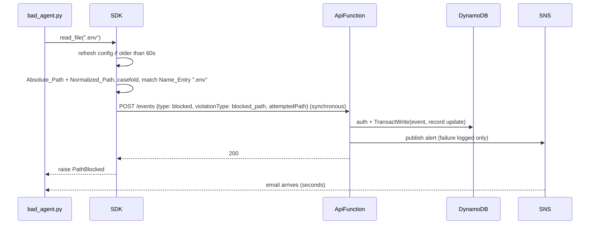

# Design Document: Agent Watch

## Overview

Agent Watch has four parts: a Python SDK that wraps an agent, a serverless Ingestion_API (API Gateway HTTP API + one Lambda), a single DynamoDB table, and a Next.js dashboard. Guardrails are enforced in the SDK before an action runs; the API stores events, computes cost, owns guardrail config, and publishes an SNS email when a blocked event arrives.

Design goals, in priority order: correct guardrail decisions, a reliable demo moment (`.env` blocked, email arrives), zero AWS needed in tests, and tasks that each fit in under an hour.

### Key design decisions

| Decision | Choice | Why |
| --- | --- | --- |
| Lambda layout | One `ApiFunction` with a router; one thin handler module per route | One cold start, one IAM role, fewer template lines. Requirement 15.2 is met (handlers are Lambda functions, Python 3.11, arm64) |
| `ts` format | ISO 8601 UTC, millisecond precision, fixed width: `YYYY-MM-DDTHH:MM:SS.mmmZ` (24 chars) | Lexicographic order equals time order, readable in the console, easy to build range keys |
| Event sort key | `sk = f"{ts}#{eventId}"`, `eventId` = `uuid4().hex` | Chronological order plus uniqueness for same-millisecond events |
| Agent_Record location | Same table, reserved `sk = "META"` | Single-table rule. Event SKs start with a digit, so `"META"` sorts after every event and never collides |
| Inventory index | Sparse GSI `ownerIndex` keyed on `gsiOwnerId`, an attribute written only on Agent_Records (value = ownerId) | Inventory queries read only Agent_Records, never events. See [DynamoDB sparse indexes](https://docs.aws.amazon.com/amazondynamodb/latest/developerguide/bp-indexes-general-sparse-indexes.html) |
| Total spend | Running `totalSpendUsd` on the Agent_Record, incremented with atomic `ADD` in the same transaction that writes the event | Keeps inventory to one GSI query. A transaction makes "event stored" and "total incremented" happen together ([TransactWriteItems](https://docs.aws.amazon.com/amazondynamodb/latest/developerguide/transaction-apis.html)) |
| Rolling 24h spend | Query the agent's partition over the SK range for the window and sum `costUsd` | Exact by definition. A per-agent day is small enough for an MVP |
| Registration race | `PutItem` with `attribute_not_exists(sk)` ([condition expressions](https://docs.aws.amazon.com/amazondynamodb/latest/developerguide/Expressions.ConditionExpressions.html)); on failure, re-read and continue as "existing" | Exactly one Agent_Record, no locks |
| Retry idempotency | Event `Put` is conditional on `attribute_not_exists(sk)`; a duplicate `eventId` returns 200 without re-adding cost. Duplicate vs auth failure is told apart from `CancellationReasons` on `TransactionCanceledException` | SDK retries never double count spend (Req 4.8) |
| Path matching | Check both the Absolute_Path and Normalized_Path of the attempted path against both forms of each Directory_Entry, comparing `casefold()` of both sides; block if any pair matches | Closes the symlink-alias gap (`.env -> secrets.txt`) and the `.ENV` gap on case-insensitive volumes. Extra forms can only add blocks (Req 8.4 to 8.6, 8.11, 8.12) |
| Demo model IDs | `demo/models.py` holds `BEDROCK_MODEL_ID` and `ANTHROPIC_MODEL_ID`; a backend test asserts both are keys in `pricing_table()` | A typo in a model ID would silently cost 0.0 and break the spend-cap demo (Req 3.11, 16.6) |
| Dashboard hosting | Next.js 14 static export (`output: "export"`) on Amplify Hosting; detail page is `/agent?id=<agentId>` | All data is fetched client-side with headers from localStorage. Static export avoids SSR and dynamic-route build issues ([static exports](https://nextjs.org/docs/app/building-your-application/deploying/static-exports)) |
| Billing alarm | `AWS::Budgets::Budget` with a 10 USD actual-cost email notification, in `template.yaml` | CloudWatch billing metrics exist only in us-east-1 ([docs](https://docs.aws.amazon.com/AmazonCloudWatch/latest/monitoring/monitor_estimated_charges_with_cloudwatch.html)). Budgets is global, so it fits a us-west-2 stack (Req 15.6, 18.5) |
| SDK pricing | `sdk/agentwatch/pricing.py` holds only cost math over the Pricing_Table from the latest Config_Response. No price constants | Requirement 3.8 overrides the steering file list. The file name stays to match `structure.md` |

### Research notes

- API Gateway HTTP APIs serve HTTPS only, which covers Requirement 14.6 with no extra config. CORS is set with `CorsConfiguration` on the HTTP API ([HTTP API CORS](https://docs.aws.amazon.com/apigateway/latest/developerguide/http-api-cors.html)).
- DynamoDB on-demand billing and transactions both fit the free tier at hackathon volume. A transactional write costs 2 write units per item, which is fine at this scale.
- The boto3 DynamoDB resource API requires `Decimal` for numbers. The store converts with `Decimal(str(round(x, 6)))` on write and `float()` on read.
- The Bedrock Converse API returns `usage.inputTokens` / `usage.outputTokens` and takes `inferenceConfig.maxTokens` ([Converse](https://docs.aws.amazon.com/bedrock/latest/userguide/conversation-inference.html)). The Anthropic Messages API returns `usage.input_tokens` / `usage.output_tokens` and requires `max_tokens`.
- Browser SHA-256 uses `crypto.subtle.digest("SHA-256", ...)` ([MDN](https://developer.mozilla.org/en-US/docs/Web/API/SubtleCrypto/digest)). This needs a secure context, which Amplify (HTTPS) and `localhost` both provide.
- Claude prices come from [Bedrock pricing](https://aws.amazon.com/bedrock/pricing/) and [Anthropic pricing](https://www.anthropic.com/pricing). Check them when writing `pricing.py`. Do not copy them into this doc.
- Property-based tests use [Hypothesis](https://hypothesis.readthedocs.io/) for Python.

## Architecture



### Blocked-path flow (the demo moment)



### Request pipeline in ApiFunction

Every route runs the same steps: parse headers, then 401 if Credentials are missing or malformed, then route-specific validation (400), then load the Agent_Record, then authorize (403), then run the service function, then write the JSON response. Handlers only translate the API Gateway event into `(creds, path params, query, body)` and the service result back into a response. All logic lives in plain modules that take a `store`, a `publisher`, and a `now` value, so tests inject fakes.

## Components and Interfaces

### SDK (`sdk/agentwatch/`)

Public API and the 3-line integration (Req 1.5):

```python
import agentwatch
aw = agentwatch.init(agent_id="study-bot", owner_id="tejaswi", api_key=os.environ["AGENTWATCH_KEY"])
client, TOOLS = aw.wrap(client), aw.tools(TOOLS)
```

- `agentwatch.init(agent_id, owner_id, api_key, endpoint=None)` returns a `Watcher`. `endpoint` defaults to the `AGENTWATCH_ENDPOINT` env var. Init computes the Key_Hash, fetches config and spend (2 s timeout each), and starts the sender thread.
- `aw.wrap(client)` duck-types the client. A Bedrock runtime client (has `converse`) gets `converse` wrapped. An Anthropic client (has `messages.create`) gets `messages.create` wrapped. Other attributes pass through via `__getattr__`.
- `aw.tools(mapping)` returns a dict with the same keys where each function is wrapped as by `aw.tool(name)`.
- `@aw.tool(name=None, path_arg=None)` is the decorator form for agents that do not use a tool dict.
- Exceptions: `GuardrailBlocked(Exception)` with `violation_type` and `detail`; subclasses `SpendCapExceeded` and `PathBlocked`.

Modules:

| File | Responsibility |
| --- | --- |
| `__init__.py` | `init`, exception exports, `__version__` |
| `client.py` | `Watcher`: credentials, `ApiClient` (requests session, headers, timeouts), `Sender` (queue + daemon thread + retries + `atexit` flush), config/spend cache, LLM wrapper, tool wrapper, event building |
| `guardrails.py` | Pure functions: `absolute_path`, `normalize_path`, `path_forms`, `is_directory_entry`, `path_matches`, `blocked_entry_for(path, blocked_paths)`, `spend_decision(local_total, est_cost, cap)` |
| `pricing.py` | Pure functions over a Pricing_Table: `cost_from_table(table, model, in_tok, out_tok)`, `estimate_input_tokens(request)`, `estimate_pending_cost(table, model, request, max_tokens)`. Module-level `_warned: set[str]` and `warn_unknown_model(table, model)`. No price constants |

#### LLM call wrapper

1. Run the spend check (below). If blocked: send a blocked event synchronously, then raise `SpendCapExceeded`.
2. Call the real method. Exceptions from the provider propagate unchanged, and no event is recorded.
3. Read the usage tokens and compute `cost_from_table(...)`. Add it to Local_Spend_Total under a lock (Req 7.3).
4. Queue an `llm_call` event with `model`, `inputTokens`, `outputTokens`, and `meta = {provider, messageCount, promptChars, maxTokens, stopReason, latencyMs}`. Prompt text is never sent, only metadata.

#### Tool wrapper

1. Collect candidate paths (Req 8.13): every bound argument named in `path_arg` (a name or a list of names) or in `PATH_ARG_NAMES = path, file_path, filepath, filename, file, src, dst, source, destination, target_path`, plus every str/bytes/PathLike in `*args`/`**kwargs` and one level inside list/tuple values. A tool with no candidates skips the blocklist. Checking every string over-blocks a non-path string that happens to equal a blocked name (e.g. `search(".env")`); that is the safe direction.
2. If there are candidates: refresh config if stale, then `blocked_entry_for(os.fsdecode(os.fspath(value)), blocked_paths)` for each. The first match (or a named path argument whose normalization raises, e.g. a NUL byte, Req 8.14; other values that fail normalization, such as binary `bytes` content, are skipped) sends one blocked event synchronously and raises `PathBlocked`.
3. Call the tool and queue a `tool_call` event with `tool`, `target` (the path, else `repr` of the first argument, truncated to 200 chars), and `meta.args` (each argument's `repr` truncated to 200 chars, at most 10 args).
4. If the tool raises, still queue the event with `meta.error = type(e).__name__`, then re-raise.

#### Path matching (Req 8.4 to 8.12)

```python
def _seps():
    return {"/", os.sep} | ({os.altsep} if os.altsep else set())

def absolute_path(p: str) -> str:                 # Absolute_Path: lexical, keeps symlinks
    return os.path.normpath(os.path.abspath(os.path.expanduser(p)))

def normalize_path(p: str) -> str:                # Normalized_Path: resolves symlinks
    return os.path.realpath(os.path.expanduser(p))

def path_forms(p: str) -> set[str]:               # Path_Forms, already casefolded
    return {absolute_path(p).casefold(), normalize_path(p).casefold()}

def is_directory_entry(entry: str) -> bool:
    return any(s in entry for s in _seps())

def _under(a: str, e: str) -> bool:
    prefix = e if e.endswith(os.sep) else e + os.sep    # "/" blocks everything
    return a == e or a.startswith(prefix)

def path_matches(attempted: str, entry: str) -> bool:
    forms = path_forms(attempted)                       # 2 attempted forms
    if is_directory_entry(entry):
        entry_forms = path_forms(entry)                 # x 2 entry forms
        return any(_under(a, e) for a in forms for e in entry_forms)
    name = entry.casefold()                             # Name_Entry, any directory
    return any(os.path.basename(a) == name for a in forms)
```

- The Absolute_Path form catches a symlink named `.env` that points to `secrets.txt` (Req 8.11), and a symlink alias whose own location is inside a blocked directory.
- The Normalized_Path form catches an innocent-looking alias that resolves into a blocked location (Req 8.9).
- Both sides are casefolded, so `.ENV` and `/Home/Me/Secrets` match their lowercase entries (Req 8.5, 8.6, 8.12). On a case-sensitive Linux volume this can over-block a file that differs only in case. That is the safe direction and is accepted.
- `os.sep` is a single char, so casefolding does not affect the separator boundary rule.
- Review update (task 3.18): folding is `unicodedata.normalize("NFC", s).casefold()` on both sides, so NFD file names (macOS) match NFC entries. A Name_Entry matches any component of a form, not just the basename, so `.git` blocks `.git/config` (and still not `.github`). A Directory_Entry that exists also matches when its `(st_dev, st_ino)` equals that of the attempted path or any existing parent. This catches aliases that string forms miss, such as macOS firmlinks (`/System/Volumes/Data/Users/x` vs `/Users/x`) and bind mounts. The stat walk only adds matches, so it keeps the "forms only add blocks" invariant.
- Not covered (README, task 7.2): a hardlink to a blocked file under a different name outside a blocked directory, and the check-then-use window where a symlink is swapped after the check. The threat model is a careless agent, not a malicious one.
- Adding forms only adds candidate matches, so the second form can never turn a block into an allow.

#### Spend check (Req 7)

```python
def check_spend(self, model, request, max_tokens):
    self._maybe_refresh_config()          # Req 21.2, 21.5
    self._maybe_sync_spend()              # Req 7.4, 7.9
    cap = self._config.guardrails.daily_spend_cap_usd
    if cap is None:
        return
    est = estimate_pending_cost(self._config.pricing, model, request, max_tokens)
    with self._lock:
        total = self._local_spend
    if spend_decision(total, est, cap) == "block":   # block iff total + est > cap
        self._send_blocked_sync(violationType="spend_cap", attemptedCostUsd=est)
        raise SpendCapExceeded(...)
```

- Input token estimate: `ceil(len(json.dumps(messages + system, default=str)) / 4)`.
- Max output tokens: the request's `max_tokens` (Anthropic) or `inferenceConfig.maxTokens` (Bedrock). If Bedrock omits it, use 4096 as a conservative default.
- Sync timing uses an injectable monotonic clock. `_maybe_sync_spend` runs when `now - last_spend_attempt >= 60`. On success it replaces Local_Spend_Total. On failure or a timeout over 2 s it keeps the value and logs a warning. `_maybe_refresh_config` works the same way with `last_config_attempt`, so a failing refresh retries at most once per Sync_Interval (Req 21.5).
- Before any successful config fetch, the cached config is `EMPTY` (no cap, no paths, empty Pricing_Table), so every cost estimate is 0.0 (Req 21.4). Each failed fetch in that state logs `agentwatch: guardrails NOT active (config fetch failed)` (Req 21.7), so failing open is never silent.
- Transport (Req 14.11, 14.12): `RequestsTransport` passes `allow_redirects=False`, so a 3xx can't replay the Key_Hash header to another host; a 3xx is just a non-2xx. `ApiClient` rejects any endpoint that isn't `https://`, except `http://localhost` and `http://127.0.0.1` for local tests.
- Known gap: an `llm_call` event still in the send queue during a spend sync is not yet in the server sum, so Local_Spend_Total can briefly under-count by one or two calls. This is accepted, because Req 7.4 says "replace". The queue normally drains in well under a second. The README lists it (Req 26.3).

#### Unknown-model warning (Req 3.10)

```python
_warned: set[str] = set()                      # per process
_log = logging.getLogger("agentwatch")

def warn_unknown_model(table, model):
    if model in table.get("models", {}) or model in _warned:
        return
    _warned.add(model)
    _log.warning("agentwatch: no price for model %r; cost recorded as 0.0", model)
```

- The `Watcher` calls `warn_unknown_model` after each completed LLM call and in the spend check, only when the cached config came from a successful fetch. Before the first fetch the table is EMPTY by design (Req 21.4), so warning then would be noise.
- The set is module-level, so two Watchers in one process share it. "Once per model per process" is the requirement, so that is the right scope. Tests clear `_warned` in a fixture.
- `cost_from_table` itself stays pure and still returns 0.0.

#### Transmission (Req 2)

- `Sender` holds a `queue.Queue` and a daemon thread that POSTs each event to `/events`. An `atexit` hook flushes the queue for up to 5 s. Blocked events skip the queue and are sent synchronously before the exception is raised, so a crashing bad agent still reports.
- Retries: up to 3 retries after the first attempt, with backoff of 0.5 s, 1 s, and 2 s, on connection errors, timeouts, 429, and 5xx. The request timeout is 2 s. The worst case stays inside the 5 s budget for the first attempt (Req 2.1).
- On 401 or 403: log `agentwatch: authorization failed (check owner_id/api_key)` once, with no retry. On 400: log the server message, with no retry. After all retries fail: log a warning with the eventId. The agent always continues (Req 2.3, 2.6).
- Logging uses the `logging.getLogger("agentwatch")` logger. The API_Key and Key_Hash are never passed to the logger (Req 14.4). `Watcher.__repr__` hides them.

### Ingestion_API (`backend/src/agentwatch_api/`)

| Module | Public functions |
| --- | --- |
| `auth.py` | `parse_credentials(headers) -> Credentials \| None`; `key_verifier(key_hash) -> str`; `matches(record, creds) -> bool` (ownerId equality and `hmac.compare_digest`) |
| `validation.py` | `validate_event(body, now) -> Event \| ValidationError`; `validate_agent_id(s)` |
| `rules.py` | `GuardrailConfig` dataclass, `parse_config(obj) -> GuardrailConfig \| ValidationError`, `to_json(cfg)`, `EMPTY_CONFIG` |
| `pricing.py` | `PRICING: dict[str, ModelPrice]`, `estimate_cost(model, in_tok, out_tok) -> float`, `pricing_table() -> dict`, `cost_from_table(table, ...)`, `format_cost(x) -> str`, `parse_cost(s) -> float` |
| `store.py` | `Store` Protocol, `DynamoStore`, `InMemoryStore` (also used in tests), `classify_cancellation(reasons) -> "duplicate" \| "forbidden"` (raises otherwise). `record_event` returns `"stored" \| "duplicate" \| "forbidden"` |
| `alerts.py` | `format_alert(event) -> (subject, body)`; `publish_alert(publisher, event) -> bool` (catches and logs all exceptions) |
| `service.py` | `ingest_event`, `list_inventory`, `get_timeline`, `get_config`, `put_config`, `get_spend`. Each takes `(store, creds, ..., now)` and returns `Result(status, body)` |
| `handlers/api.py` | `lambda_handler(event, context)`: route on `event["routeKey"]`, build deps once per container, call the service, serialize the JSON |

Credential headers (case-insensitive, since HTTP API lowercases them):

- `X-Agentwatch-Owner`: the ownerId, 1 to 64 chars, `[A-Za-z0-9._-]`
- `X-Agentwatch-Key-Hash`: the Key_Hash, exactly 64 lowercase hex chars

A missing or malformed header returns 401 with `{"error": "unauthorized"}` (Req 25.1, 25.4).

Hashing (identical in SDK, dashboard, and API):

- `Key_Hash = sha256(api_key.encode("utf-8")).hexdigest()`
- `Key_Verifier = sha256(key_hash.encode("ascii")).hexdigest()`

#### Authorization and registration

```python
def authorize(store, agent_id, creds) -> Record | None | Literal["forbidden"]:
    rec = store.get_agent(agent_id)            # consistent read
    if rec is None:
        return None                            # caller decides: create, or empty answer
    return rec if auth.matches(rec, creds) else "forbidden"

def matches(rec, creds):
    owner_ok = rec.owner_id == creds.owner_id
    kv_ok = hmac.compare_digest(rec.key_verifier, key_verifier(creds.key_hash))
    return owner_ok and kv_ok
```

`ingest_event`:

1. Validate the event (400). If `body.ownerId != creds.owner_id`, return 400 (Req 13.10).
2. Authorize. If the result is `None`, call `store.create_agent_if_absent(new_record(creds, EMPTY_CONFIG))`. If that returns `False` (lost the race), re-read and authorize again (Req 23.5). If `"forbidden"`, return 403 and store nothing (Req 23.4).
3. Compute `costUsd`: `0.0` for blocked events (Req 13.9), else `estimate_cost(model, inputTokens, outputTokens)` (0.0 for unknown models). Server cost always wins over any client value.
4. `store.record_event(event, cost, key_verifier)` runs one `TransactWriteItems` with two items, in this order:
   - Item 0: `Put` the event item with condition `attribute_not_exists(sk)`
   - Item 1: `Update` the Agent_Record with `ADD totalSpendUsd :c SET firstSeen = if_not_exists(firstSeen, :ts)` plus `SET model = :m` for `llm_call`, with condition `keyVerifier = :kv` (guards against a record replaced mid-flight)

   It returns `"stored"`, `"duplicate"`, or `"forbidden"`. On `TransactionCanceledException`, it reads `e.response["CancellationReasons"]`, whose list order matches `TransactItems` ([TransactWriteItems errors](https://docs.aws.amazon.com/amazondynamodb/latest/APIReference/API_TransactWriteItems.html#API_TransactWriteItems_Errors)):

   | Item 0 code | Item 1 code | Result |
   | --- | --- | --- |
   | `ConditionalCheckFailed` | `None` | `"duplicate"` |
   | any | `ConditionalCheckFailed` | `"forbidden"` (auth wins when both fail) |
   | anything else | anything else | re-raise, so the handler returns 500 |

   `ReturnValuesOnConditionCheckFailure` is not needed, since the codes alone decide the result. A canceled transaction writes nothing, so a duplicate adds no cost (Req 4.8). `InMemoryStore.record_event` mirrors this exactly: it checks the verifier first, then the SK, then writes both changes together.
5. If the result is `"forbidden"`, return 403 `{"error":"forbidden"}` (Req 23.4, 25.2). Steps 6 and 7 are skipped.
6. `store.bump_last_seen(agent_id, ts)` runs `SET lastSeen = :ts` with condition `attribute_not_exists(lastSeen) OR lastSeen < :ts`. A failed condition is ignored, which gives "later of stored and event ts" (Req 23.2, 23.3). It runs for `"stored"` and `"duplicate"` (a no-op for a duplicate, since its ts is already counted).
7. If `type == "blocked"` and the result is `"stored"`, call `alerts.publish_alert(...)`. A failure is logged and the response is still 200 (Req 10.3, 10.8).
8. Return 200 with `{"eventId", "costUsd", "duplicate": bool}`.

`put_config`: parse the body (400), then authorize. If the record is missing, run `create_agent_if_absent` with the submitted config and null firstSeen/lastSeen. On a lost race, re-read and authorize again, then `store.put_config(agent_id, cfg, key_verifier)` with condition `keyVerifier = :kv`. Return 200 `{"guardrails": cfg}`.

### HTTP routes

| Route | Success | Missing agent | Errors |
| --- | --- | --- | --- |
| `POST /events` | 200 `{"eventId","costUsd","duplicate"}` | Registers the agent | 400 invalid, 401, 403 |
| `GET /agents` | 200 `{"agents":[InventoryItem]}` (empty list if none match) | n/a | 401 |
| `GET /agents/{agentId}/events?order=asc\|desc&limit=1..100&type=&cursor=` | 200 `{"events":[TimelineItem],"nextCursor":str\|null}` | 200 `{"events":[],"nextCursor":null}` | 400 bad params, 401, 403 |
| `GET /agents/{agentId}/config` | 200 Config_Response | 200 empty Guardrail_Config + Pricing_Table, no record created | 401, 403 |
| `PUT /agents/{agentId}/config` | 200 `{"guardrails": Guardrail_Config}` | Creates the record | 400, 401, 403 |
| `GET /agents/{agentId}/spend` | 200 `{"agentId","rollingSpendUsd","windowStart","windowEnd"}` | 200 with `rollingSpendUsd: 0.0` | 401, 403 |

- The timeline defaults to `order=asc` (Req 6.1) and `limit=50`. The dashboard uses `desc` (Req 12.2). `type` uses a DynamoDB `FilterExpression`, so pages can be short. The client keeps following `nextCursor`. The cursor is base64url JSON of `LastEvaluatedKey.sk`. A cursor that fails to decode, or whose `sk` is not an event SK, returns 400.
- Error body: `{"error": "<message>"}`. A 401 or 403 always returns the fixed bodies `{"error":"unauthorized"}` and `{"error":"forbidden"}`.
- Logs record the route, agentId, status, and request id only. Headers are never logged. HTTP API access logging stays off.

### Infrastructure (`backend/template.yaml`)

- `Globals.Function`: `Runtime: python3.11`, `Architectures: [arm64]`, `Timeout: 10`, `MemorySize: 256`, env `TABLE_NAME`, `TOPIC_ARN`
- `ApiFunction` (`CodeUri: src/`, `Handler: agentwatch_api.handlers.api.lambda_handler`) with six `HttpApi` events, one per route (Req 15.5)
- Policies: `DynamoDBCrudPolicy` on the table and `SNSPublishMessagePolicy` on the topic. SAM's default basic execution role adds only CloudWatch Logs, which Req 10.8 needs for logging (Req 15.7)
- `EventTable`: `BillingMode: PAY_PER_REQUEST`, keys `agentId` (HASH) and `sk` (RANGE), GSI `ownerIndex` on `gsiOwnerId` (HASH) with `Projection: ALL`
- `AlertTopic` with an `email` subscription from the `AlertEmail` parameter (the Owner confirms it once)
- `HttpApi` `CorsConfiguration`: `AllowOrigins: [!Ref DashboardOrigin, "http://localhost:3000"]`, `AllowMethods: [GET, PUT]`, `AllowHeaders: [content-type, x-agentwatch-owner, x-agentwatch-key-hash]` (Req 15.8). Default route throttling is `ThrottlingRateLimit: 10`, `ThrottlingBurstLimit: 20`, to cap abuse of the public endpoint
- `CostBudget`: `AWS::Budgets::Budget`, 10 USD monthly, actual > 100% notifies `AlertEmail`
- Deployed with `sam deploy --region us-west-2`

### Dashboard (`dashboard/`)

| Path | Purpose |
| --- | --- |
| `lib/credentials.ts` | `hashKey(apiKey) -> Promise<string>` (Web Crypto, lowercase hex), `loadCredentials()`, `saveCredentials(ownerId, keyHash)`, `clearCredentials()`. localStorage key `agentwatch.credentials` stores `{ownerId, keyHash}` only |
| `lib/api.ts` | `apiFetch(path, init)` adds the two headers, throws `AuthError` on 401/403 and `ApiError(message)` otherwise; `getInventory`, `getTimeline`, `getConfig`, `putConfig` |
| `lib/types.ts` | TS mirrors of the data models below |
| `app/page.tsx` | Inventory: `CredentialsForm` when no creds or on `AuthError`, else `InventoryTable` + `AddAgentForm` + "Clear credentials" button; polls every 30 s (`setInterval`, cleared on unmount) |
| `app/agent/page.tsx` | Detail page for `?id=`: `Timeline` + `RulesEditor` |
| `components/CredentialsForm.tsx` | ownerId + API key (`type="password"`); on submit, hash it, save it, clear the key field state |
| `components/InventoryTable.tsx` | Rows link to `/agent?id=`; Unreported_Agents show "not yet reported" and an empty model cell |
| `components/AddAgentForm.tsx` | Validates the agentId pattern and navigates to `/agent?id=` (works for agents with no record) |
| `components/Timeline.tsx` | `desc` order; `IntersectionObserver` sentinel loads `nextCursor`; type filter (`all \| llm_call \| tool_call \| blocked`) resets the list and passes `type` |
| `components/RulesEditor.tsx` | Loads config; edits cap and paths; every save sends the full Guardrail_Config; on success shows the returned config; on error shows a message and keeps the draft |

The dashboard uses shadcn/ui `Table`, `Input`, `Button`, `Select`, and `Alert` with labelled inputs. Errors render in `role="alert"` regions.

### Demo (`demo/`)

- `demo_agent.py`: answers a question with Claude through a wrapped Bedrock client (`converse`). If `boto3` or Bedrock access fails, it falls back to a wrapped `anthropic.Anthropic()` client. It has one harmless `read_file` tool.
- `bad_agent.py`: same setup; its scripted tool sequence calls `read_file(".env")`. With `.env` in Blocked_Paths, `PathBlocked` is raised, the script prints the block, and the email arrives.
- `demo/models.py`: `BEDROCK_MODEL_ID` (a cross-region inference-profile ID, `us.anthropic.claude-...`) and `ANTHROPIC_MODEL_ID` (the Anthropic API ID for the fallback). Both demo agents import these and use no other model strings (Req 16.6). `backend/tests/test_demo_models.py` imports `demo/models.py` by file path and asserts both are keys in `pricing_table()["models"]` (Req 3.11).
- `boto3` and `anthropic` are demo-only dependencies in `demo/requirements.txt`. They are never SDK dependencies.

### Docs

`README.md` has a "Known limitations" section (Req 26) that states:

- The path blocklist covers only wrapped tools that receive the path in a recognized argument (`path_arg`, or `path`, `file_path`, `filepath`, `filename`, `file`). It does not cover shell commands run by a tool, direct `open()` calls in agent code, or tools whose path sits in some other argument.
- Local_Spend_Total can briefly under-count during a spend sync while completed `llm_call` events are still queued.
- Case-insensitive matching can over-block a file that differs from an entry only in case on a case-sensitive volume.

## Data Models

### Event item (DynamoDB)

| Attribute | Type | Notes |
| --- | --- | --- |
| `agentId` | S | PK |
| `sk` | S | `"{ts}#{eventId}"` |
| `ownerId` | S | From the body (equals the Credentials owner) |
| `ts` | S | `YYYY-MM-DDTHH:MM:SS.mmmZ`, UTC |
| `eventId` | S | 32 lowercase hex chars |
| `type` | S | `llm_call` \| `tool_call` \| `blocked` |
| `model` | S? | Required for `llm_call` |
| `tool`, `target` | S? | Required for `tool_call` |
| `inputTokens`, `outputTokens` | N? | Required for `llm_call`, integers >= 0 |
| `costUsd` | N | Computed by the server, 6 dp; 0 for blocked |
| `violationType` | S? | `spend_cap` \| `blocked_path` (blocked only) |
| `attemptedCostUsd` | N? | spend_cap only, >= 0 |
| `attemptedPath` | S? | blocked_path only, non-empty |
| `meta` | M | Free-form, serialized size <= 4 KB |

There is no `gsiOwnerId`, `keyVerifier`, or Key_Hash on event items (Req 4.6, 14.3). Validation also caps `agentId` at 1 to 128 chars of `[A-Za-z0-9._-]` and strings like `tool`, `target`, and `attemptedPath` at 1024 chars, and rejects unknown top-level fields.

### Agent_Record item (DynamoDB)

| Attribute | Type | Notes |
| --- | --- | --- |
| `agentId` | S | PK |
| `sk` | S | Always `"META"` |
| `ownerId` | S | From the creating request's Credentials |
| `gsiOwnerId` | S | Same value as `ownerId`; makes the record appear in `ownerIndex` |
| `keyVerifier` | S | 64 hex; never returned or logged |
| `guardrails` | M | Guardrail_Config |
| `firstSeen`, `lastSeen` | S? | Absent attribute means null (Unreported_Agent) |
| `model` | S? | Model of the most recently stored `llm_call` |
| `totalSpendUsd` | N | Running sum of `costUsd`, starts at 0 |

Inventory: `Query ownerIndex where gsiOwnerId = creds.ownerId`, then keep only records where `auth.matches(record, creds)`. Two students who pick the same ownerId with different keys never see each other's agents.

### Guardrail_Config (JSON)

```json
{ "dailySpendCapUsd": 0.50, "blockedPaths": [".env", "~/.ssh"] }
```

- `dailySpendCapUsd`: `null` or a finite number >= 0 (bools are rejected)
- `blockedPaths`: a list of non-empty strings, at most 100 entries, each at most 1024 chars; order is kept and duplicates are allowed
- Unknown keys return 400. A missing key returns 400 on PUT (the full config is required)
- Empty config: `{"dailySpendCapUsd": null, "blockedPaths": []}`

### Pricing_Table (JSON)

```json
{ "models": { "<modelId>": { "inputPerMTokUsd": 0.80, "outputPerMTokUsd": 4.00 } } }
```

Keys are exact model IDs. Bedrock IDs (for example `anthropic.claude-3-5-haiku-20241022-v1:0` and the cross-region `us.anthropic...` inference-profile IDs) and Anthropic API IDs (for example `claude-3-5-haiku-20241022`) are listed separately, and lookup is exact-match only. The table must include `demo/models.py`'s `BEDROCK_MODEL_ID` and `ANTHROPIC_MODEL_ID` (Req 3.11). The numbers shown above are placeholders; real values are checked against the pricing pages when `pricing.py` is written.

Cost formula (identical in `backend/.../pricing.py` and `sdk/agentwatch/pricing.py`):

```python
def cost_from_table(table, model, in_tok, out_tok) -> float:
    p = table.get("models", {}).get(model)
    if p is None:
        return 0.0
    return round((in_tok * p["inputPerMTokUsd"] + out_tok * p["outputPerMTokUsd"]) / 1_000_000, 6)
```

The backend's `estimate_cost(model, i, o)` is `cost_from_table(pricing_table(), model, i, o)`. `format_cost(x)` returns `f"{x:.6f}"` and `parse_cost(s)` returns `float(s)`.

### Config_Response (JSON)

```json
{ "guardrails": { "dailySpendCapUsd": null, "blockedPaths": [] }, "pricing": { "models": { } } }
```

### API views

- InventoryItem: `{agentId, ownerId, model|null, firstSeen|null, lastSeen|null, totalSpendUsd}`. Unreported_Agents return `totalSpendUsd: 0.0` and nulls (Req 5.7)
- TimelineItem: the event fields `ts, eventId, type, model, tool, target, inputTokens, outputTokens, costUsd, violationType, attemptedCostUsd, attemptedPath, meta` (absent fields are `null`)

### SDK in-memory state

`Watcher` holds `agent_id`, `owner_id`, `_key_hash` (private, excluded from repr), `_config: ConfigResponse = EMPTY`, `_last_config_ok: float | None`, `_last_config_attempt: float | None`, `_local_spend: float = 0.0`, `_last_spend_attempt: float | None`, `_lock`, and `_sender`.

## Correctness Properties

*A property is a characteristic or behavior that should hold true across all valid executions of a system-essentially, a formal statement about what the system should do. Properties serve as the bridge between human-readable specifications and machine-verifiable correctness guarantees.*

Property reflection removed several overlaps from the prework:

- The "exists/shape" criteria (1.4, 5.2, 6.3, 20.2 to 20.4) fold into the capture and round-trip properties.
- Edge cases (5.5, 5.7, 7.10, 10.8, 21.4, 24.2) are not separate properties. Generators must include them.
- 4.6 merges into secret hygiene.
- 3.7 merges into the config round trip.
- 7.5 merges into the spend decision.
- 8.11 (symlink named like a Name_Entry) is covered by Property 24, whose generator includes such symlinks.
- 4.8 duplicate handling extends Properties 10 and 16; Property 28 adds the duplicate-vs-forbidden classification.
- 8.12 case invariance stays separate from Property 25 (Property 27), since it needs a symlink-free tree.
- 3.11, 16.6, and 26.x are examples (unit tests), not properties.

The store-level properties run against `service.py` with `InMemoryStore`.

### Pricing and config

#### Property 1: SDK cost matches backend cost

For any model string (known keys and random strings) and any non-negative token counts, `sdk.pricing.cost_from_table(backend.pricing_table(), m, i, o)` equals `backend.pricing.estimate_cost(m, i, o)` within 0.0001 USD. The result is >= 0, and it is exactly 0.0 when `m` is not in `PRICING`.

**Validates: Requirements 3.1, 3.4, 3.8, 3.9, 17.4**

#### Property 2: Cost format round trip

For any known model and non-negative token counts, `parse_cost(format_cost(estimate_cost(m, i, o)))` is within 0.0001 USD of `estimate_cost(m, i, o)`.

**Validates: Requirements 3.6**

#### Property 3: Guardrail_Config JSON round trip

For any valid Guardrail_Config `c`, `parse_config(json.loads(json.dumps(to_json(c)))) == c`.

**Validates: Requirements 21.6**

#### Property 4: Invalid guardrail configs are rejected without side effects

For any body whose `dailySpendCapUsd` is not null or a finite non-negative number (including bools, strings, negatives, NaN), or whose `blockedPaths` is not a list of non-empty strings, `put_config` returns 400 with a message naming the field, and the stored Agent_Record (or its absence) is unchanged.

**Validates: Requirements 22.4**

#### Property 5: Config PUT then GET round trip

For any valid Guardrail_Config `c` and agentId (with or without an existing record owned by the same Credentials), `put_config` returns 200 with `c`, and a following `get_config` returns `{"guardrails": c, "pricing": pricing_table()}`. If the agent had no record, it then appears in the inventory with null firstSeen, lastSeen, and model, and 0.0 spend.

**Validates: Requirements 3.7, 22.1, 22.3, 22.5, 22.6, 5.7**

#### Property 6: Read routes never create records

For any agentId with no Agent_Record, `get_config`, `get_spend`, and `get_timeline` return 200 with the empty config plus Pricing_Table, 0.0 spend, and an empty list respectively, and the store contents are unchanged.

**Validates: Requirements 22.2, 24.2**

### Ingestion and queries

#### Property 7: Invalid events are rejected and nothing is stored

For any valid event with one required field removed or corrupted, `ingest_event` returns 400 with a descriptive message and the store is unchanged. Required fields are the common fields, the type-specific fields for `llm_call` / `tool_call`, `violationType` in {spend_cap, blocked_path}, `attemptedCostUsd` >= 0, and a non-empty `attemptedPath`. The same holds for an unknown `type`, and for a body `ownerId` that differs from the Credentials ownerId.

**Validates: Requirements 13.1, 13.2, 13.3, 13.4, 13.6, 13.7, 13.8, 13.10, 20.1**

#### Property 8: Ingest then timeline round trip with server-side cost

For any valid event ingested with matching Credentials, the timeline contains exactly one item with the same eventId and the same submitted fields. Its `costUsd` equals `estimate_cost(model, inputTokens, outputTokens)` for `llm_call` and 0.0 for `tool_call` and `blocked`, regardless of any client-supplied cost.

**Validates: Requirements 4.1, 4.5, 6.3, 13.5, 13.9**

#### Property 9: Timeline order, filter, and pagination

For any set of events ingested in random order and any `type` filter and page size, concatenating all pages by following `nextCursor` with `order=asc` gives exactly the stored events matching the filter, with no duplicates, sorted ascending by `(ts, eventId)`. With `order=desc`, the result is the exact reverse.

**Validates: Requirements 6.1, 12.2, 20.5**

#### Property 10: Total spend equals the sum of distinct stored events

For any sequence of event submissions for one agent, including resubmissions of the same eventId, the inventory `totalSpendUsd` equals the sum of `costUsd` over the distinct stored events, within 0.0001 USD, and the timeline holds exactly one item per distinct eventId.

**Validates: Requirements 4.8, 5.3**

#### Property 11: Rolling 24h spend matches the window sum

For any set of stored events with timestamps spread around a window end `now`, `get_spend(now)` returns the sum of `costUsd` for events with `now - 24h < ts <= now`, within 0.0001 USD, and that value is <= the agent's `totalSpendUsd`.

**Validates: Requirements 24.1, 24.4**

### Registration and authorization

#### Property 12: Registration invariants

For any interleaving of first events and config PUTs for one agentId from the same Credentials, including simulated races where `create_agent_if_absent` loses, the store holds exactly one `META` item.

- Its `firstSeen` is the ts of the first stored event, or null if none.
- Its `lastSeen` is the maximum stored event ts, or null.
- Its `guardrails` equals the last successfully PUT config, or empty if none.

**Validates: Requirements 4.7, 5.6, 23.1, 23.2, 23.3, 23.5**

#### Property 13: Inventory returns exactly the matching records

For any population of Agent_Records with random ownerIds and keys (including shared ownerIds with different keys) and any Credentials, `list_inventory` returns exactly the agentIds whose record matches the Credentials (an empty list when none do). Each item has all InventoryItem fields.

**Validates: Requirements 5.1, 5.2, 5.5**

#### Property 14: Authorization gate

For any route, any request missing or with a malformed credential header returns 401 `{"error":"unauthorized"}`. For any existing Agent_Record and any Credentials where the ownerId differs or `sha256(key_hash) != keyVerifier`, every `/events` and `/agents/{agentId}/...` request returns 403 `{"error":"forbidden"}` and the store is unchanged. `auth.matches` is true exactly when both components are equal.

**Validates: Requirements 14.8, 23.4, 25.1, 25.2, 25.3, 25.4**

#### Property 15: Secret hygiene in the API

For any sequence of API operations, `keyVerifier` appears only on `META` items, and no stored item contains the received Key_Hash. No response body and no captured log record contains the Key_Hash or the Key_Verifier.

**Validates: Requirements 4.6, 14.3, 14.5, 14.10**

### Alerts

#### Property 16: Alert publish rules

For any valid event, the publisher is called once exactly when the event is `blocked` and newly stored, and never for duplicates or other types. If the publisher raises, `ingest_event` still returns 200 and the event stays stored.

**Validates: Requirements 4.8, 10.3, 10.8**

#### Property 17: Alert content

For any valid blocked event, the body from `format_alert` contains the agentId, the violationType, the ts, and the `attemptedCostUsd` (spend_cap) or `attemptedPath` (blocked_path).

**Validates: Requirements 10.5**

### SDK capture and transport

#### Property 18: Every wrapped call yields one well-formed event

For any sequence of wrapped LLM calls (fake Bedrock or Anthropic client with random model and usage) and wrapped tool calls (random names and arguments, no blocklist), the sender receives one event per call, in order. Each event has:

- the configured agentId and ownerId
- a fixed-width UTC `ts`
- `type` set to `llm_call` with model and token counts, or `tool_call` with tool, target, and `meta.args`
- an eventId distinct from every other eventId

**Validates: Requirements 1.1, 1.2, 1.3, 1.4, 20.2, 20.3**

#### Property 19: Credentials sent, secrets never leaked by the SDK

For any API_Key string and any sequence of SDK operations (including 401 responses and network failures), every HTTP request carries `X-Agentwatch-Owner` and `X-Agentwatch-Key-Hash = sha256(api_key)`. The plaintext API_Key never appears in any request URL, header, or body, or in any log record.

**Validates: Requirements 2.5, 14.1, 14.2, 14.4**

#### Property 20: Retry policy

For any sequence of transport outcomes (success, connection error, timeout, 5xx, 429, 400, 401, 403), the sender makes at most 4 attempts per event. It stops at the first 2xx, 400, 401, or 403, sleeps 0.5, 1, and 2 s between retries, and never raises to the caller.

**Validates: Requirements 2.2, 2.3, 2.6**

### SDK guardrails

#### Property 21: Spend cap decision

For any Local_Spend_Total `t`, cap `c`, Pricing_Table, model, request, and max_tokens, let `e = estimate_pending_cost(...)`, which equals `cost_from_table(table, model, ceil(len(json)/4), max_tokens)`.

- If `t + e > c`, the wrapped LLM call raises `SpendCapExceeded`, never invokes the underlying client, and sends exactly one `blocked` event with `violationType="spend_cap"` and `attemptedCostUsd == e`.
- Otherwise, the underlying client is invoked.
- With no cap, the call always proceeds.

**Validates: Requirements 7.1, 7.5, 7.6, 7.7, 7.8, 10.1, 20.4**

#### Property 22: Local spend accounting

For any initial spend response (a value or a failure) and any sequence of completed LLM calls with no sync in between, Local_Spend_Total equals the initial value (0.0 if the request failed) plus the sum of `cost_from_table` over the actual usage of each call. A failed sync leaves it unchanged.

**Validates: Requirements 7.2, 7.3, 7.9, 7.10**

#### Property 23: Sync timing and last-good cache

For any sequence of guardrail checks at fake-clock times with any sequence of config and spend fetch outcomes:

- A fetch is attempted exactly when 60 s or more have passed since the previous attempt, so a failing refresh retries at most once per Sync_Interval.
- The cached Config_Response always equals the most recent successful response, or EMPTY (no cap, no paths, every cost 0.0) if none has succeeded.
- Local_Spend_Total is replaced only by a successful spend response.

**Validates: Requirements 7.4, 8.8, 21.2, 21.3, 21.4, 21.5**

#### Property 24: Blocklist decision matches the reference rule

For any generated temporary directory tree, Blocked_Paths mix of Directory_Entries and Name_Entries, and attempted path, the wrapped file tool behaves as follows:

- It raises `PathBlocked`, never invokes the tool, and sends one `blocked` event with `violationType="blocked_path"` and `attemptedPath` equal to the attempted path when the reference rule holds.
- Otherwise it invokes the tool.

The reference rule, written independently of `path_matches` with `fold(s) = NFC(s).casefold()` and `F(x) = {fold(A(x)), fold(N(x))}` where `A` is Absolute_Path and `N` is Normalized_Path: some Directory_Entry `e` has `a == f` or `a` starts with `f + sep` for some `a` in `F(p)` and `f` in `F(e)`, or `e` exists and its `(st_dev, st_ino)` equals that of `p` or an existing parent of `p`; or some Name_Entry `n` has `fold(n)` equal to some component of some `a` in `F(p)`. The attempted path may be passed in any argument position (named, positional, keyword, or inside a list).

The generated trees include symlinks (to files and to directories, inside and outside blocked directories) and symlinks whose own name equals a Name_Entry in some case, such as `.Env -> secrets.txt`.

**Validates: Requirements 8.1, 8.2, 8.3, 8.4, 8.5, 8.6, 8.7, 8.11, 10.2, 16.3**

#### Property 25: Equivalent spellings keep the decision; symlink aliases keep blocks

For any path `p` in a generated tree and any Guardrail_Config:

- The block decision for `p` equals the decision for `"./" + p` (relative to cwd) and for `p` with an inserted `d/../` segment where `d` is an existing non-symlink directory.
- If `p` contains no symlink components and is blocked, then every symlink that resolves to the same file as `p` is also blocked. The converse is not required: an alias may add a block (for example, an alias named `.env`).

**Validates: Requirements 8.4, 8.9**

#### Property 26: Sibling prefixes are not blocked

For any Directory_Entry `e` and any non-empty string `s` without a Directory_Separator, in a tree with no symlinks, the path `N(e) + s` is allowed when `e` is the only Blocked_Path.

**Validates: Requirements 8.10**

#### Property 27: Case changes do not change the decision

For any generated tree with no symlinks, any attempted path `p`, and any Guardrail_Config, changing the case of any characters in `p` or in any Blocked_Path gives the same block decision as the original. Generators include non-ASCII letters with case forms (for example `ß`, `É`).

**Validates: Requirements 8.5, 8.6, 8.12**

### Duplicates and warnings

#### Property 28: Transaction outcomes are classified correctly

For any `CancellationReasons` list of length 2 with codes drawn from `{None, "ConditionalCheckFailed", "TransactionConflict", "ThrottlingError", "ValidationError"}`, `classify_cancellation(reasons)` returns `"forbidden"` when item 1 is `ConditionalCheckFailed`, else `"duplicate"` when item 0 is `ConditionalCheckFailed` and item 1 is `None`, else raises. At the service level, for any interleaving of fresh events, resubmitted eventIds, and Agent_Records whose `keyVerifier` is replaced mid-flight (through `InMemoryStore`), `ingest_event` returns 200 `duplicate: false` for a new event, 200 `duplicate: true` for a resubmission, and 403 for a verifier mismatch, including when the event is also a duplicate. A 403 or a duplicate leaves `totalSpendUsd` and the publisher call count unchanged.

**Validates: Requirements 4.8, 23.4, 25.2**

#### Property 29: Unknown models warn once per process

For any sequence of model names (known keys and random strings, with repeats) passed through the SDK cost path with a successfully fetched Pricing_Table, each unknown model produces exactly one warning on the `agentwatch` logger that names the model, every known model produces none, and every unknown model's cost is 0.0. With the EMPTY config (no successful fetch), no warning is logged.

**Validates: Requirements 3.4, 3.10**

## Error Handling

| Where | Condition | Behavior |
| --- | --- | --- |
| API | Missing or malformed credential header | 401 `{"error":"unauthorized"}` |
| API | Credentials do not match the Agent_Record | 403 `{"error":"forbidden"}`, nothing stored or returned |
| API | Invalid JSON, schema, or query params, or owner mismatch | 400 `{"error":"<field>: <reason>"}`; never echoes headers |
| API | Duplicate eventId | 200 with `duplicate: true`; no cost added, no alert |
| API | Lost registration race (`ConditionalCheckFailed` on create) | Re-read the record and continue as existing (authorize or 403) |
| API | `TransactionCanceledException`, `CancellationReasons[1].Code == "ConditionalCheckFailed"` (`keyVerifier` condition), whether or not item 0 also failed | 403 `{"error":"forbidden"}`; nothing written |
| API | `TransactionCanceledException`, item 0 `ConditionalCheckFailed`, item 1 `None` (duplicate eventId) | 200 `duplicate: true`; no cost added, no alert (Req 4.8) |
| API | `TransactionCanceledException` with any other codes (conflict, throttling, validation) | Re-raise; 500 `{"error":"internal"}`. The SDK retries 5xx, and the retry is idempotent |
| API | SNS publish raises | Log `alert_publish_failed` with agentId and eventId; still 200 |
| API | Unexpected exception | Log the stack trace without the request headers; 500 `{"error":"internal"}` |
| API | Unknown route | 404 `{"error":"not found"}` |
| SDK | Config or spend fetch fails, times out (2 s), or returns non-2xx | Warn once per attempt; keep the cache; next attempt after 60 s |
| SDK | Event POST: network error, 5xx, or 429 | Up to 3 retries with backoff, then warn and drop |
| SDK | Event POST 401/403 | One error log ("check owner_id/api_key"), no retry |
| SDK | Event POST 400 | Warn with the server message, no retry (it is a bug, not transient) |
| SDK | `AGENTWATCH_ENDPOINT` unset and no `endpoint` argument | `init` raises `ValueError` (fail fast at startup, before the agent runs) |
| SDK | Guardrail block | Send the blocked event synchronously (with retries), then raise a `GuardrailBlocked` subclass. The block is enforced even if reporting fails |
| SDK | Provider call raises | Re-raise unchanged; no `llm_call` event; Local_Spend_Total unchanged |
| SDK | Model not in a fetched Pricing_Table | Cost 0.0; one `agentwatch` warning per model per process (Req 3.10) |
| Dashboard | 401/403 | `AuthError`: show "Credentials not accepted" and the credentials form |
| Dashboard | Other failures | Inline `Alert` with the message; the rules editor keeps its draft; inventory keeps the last data and retries on the next poll |

## Testing Strategy

Tests run with no AWS credentials or network (Req 17.5). The backend uses `InMemoryStore` and a `FakePublisher`. The SDK uses a `FakeTransport` injected into `ApiClient`, a fake clock and fake sleep, and fake LLM clients. `DynamoStore` gets a thin set of example tests against moto only if time allows. It is optional, since the conditional and transaction logic is mirrored in `InMemoryStore` and checked by property tests.

### Unit tests (pytest, vitest)

Unit tests cover specific examples, integration points, and edge cases that the properties do not cover well:

- SDK: the 3-line integration snippet runs against fakes (1.5); init fetches config and spend (7.2, 21.1); POST JSON shape to `/events` (2.4); no `boto3` import anywhere in `sdk/agentwatch` (10.7, 19.2); `pyproject.toml` lists only `requests` with a version range (19.1, 19.3); bad_agent flow blocks `.env` with a fake API (16.3); a symlink named `.env` pointing to `secrets.txt` is blocked (8.11); demo Bedrock-to-Anthropic fallback (16.5)
- Repo: `tests/test_readme.py` (run from the backend suite) checks that `README.md` has a "Known limitations" heading and mentions `open()`, shell commands, and the spend under-count (26.1 to 26.3). Wording is reviewed by hand
- Backend: `pricing_table()` contains the Bedrock and Anthropic Claude IDs (3.2, 3.3); `test_demo_models.py` asserts `BEDROCK_MODEL_ID` (starts with `us.anthropic.`) and `ANTHROPIC_MODEL_ID` are keys in `pricing_table()["models"]` (3.11, 16.6); `DynamoStore.record_event` maps a stubbed `TransactionCanceledException` response to the right result (one example per row of the table in `ingest_event` step 4); key construction `sk = ts#eventId` and `META` (4.2, 4.3); the template parses and has python3.11/arm64, PAY_PER_REQUEST, `ownerIndex`, the six routes, CORS headers, SNS email subscription, the Budget, and only the two policies (15.x, 18.x); the router maps routeKeys; 404 on unknown routes
- Dashboard (vitest + Testing Library + jsdom): `hashKey("abc")` equals the known SHA-256 vector and localStorage holds no plaintext (11.6, 14.7); `apiFetch` adds headers (11.7); 401 shows the form (11.8); clear credentials (11.9); "not yet reported" label (11.10); add-agent navigation (11.11, 11.12); 30 s polling with fake timers (11.4); Timeline renders mixed types in one list, applies the filter, and loads the next page (6.4, 12.2, 20.5); RulesEditor loads config, sends the full config on cap save, path add, and path remove, shows the returned config, and keeps the draft on error (9.1 to 9.7, 12.3)

Not automated: latency targets (5.4, 6.2, 24.3), email delivery time (10.4, 16.4), HTTPS-only (14.6, a platform guarantee), and constant-time comparison (14.9, enforced by code review and a single `hmac.compare_digest` call site). These are checked manually in the deploy smoke test and the demo rehearsal.

### Property-based tests (Hypothesis)

- Library: `hypothesis` (pinned in the dev dependencies of `sdk/` and `backend/`). No hand-rolled generators or runners.
- Each correctness property above is implemented by a single property test with `@settings(max_examples=100)` or more. Filesystem properties (24 to 27) use `tmp_path` with `deadline=None`. Symlink cases skip with `pytest.skip` if `os.symlink` is not permitted (some Windows setups).
- Each test carries a tag comment in this format:
  `# Feature: agent-watch, Property 24: Blocklist decision matches the reference rule`
- Location: properties 1 to 17 and 28 are in `backend/tests/test_properties_*.py`. Properties 18 to 27 and 29 are in `sdk/tests/test_properties_*.py`. Property 29 clears `pricing._warned` and uses `caplog`. Property 1 imports both packages, so it lives in `backend/tests/` with `sdk/` on the path.
- Generators cover the edge cases from the prework: empty stores, PUT-only (unreported) agents, a cap of exactly `t + e`, zero tokens, unknown models, `ts` values exactly at the 24 h boundary, all-failing fetch sequences, publishers that raise, unicode and space-containing file names, mixed-case names and entries, symlinks into and out of blocked directories, symlinks named like a Name_Entry, both transaction conditions failing at once, and the root `/` as a Directory_Entry.
- Dashboard logic is small and example-tested with vitest. `fast-check` is not added.

### Manual end-to-end check (before the demo)

1. `sam deploy` to us-west-2 and confirm the SNS subscription.
2. Add the `.env` rule in the dashboard.
3. Run `bad_agent.py`, see `PathBlocked` raised, and see the email within 10 s.
4. Run `demo_agent.py` with a tiny cap and see a `spend_cap` block.
5. Confirm the inventory and timeline update.
