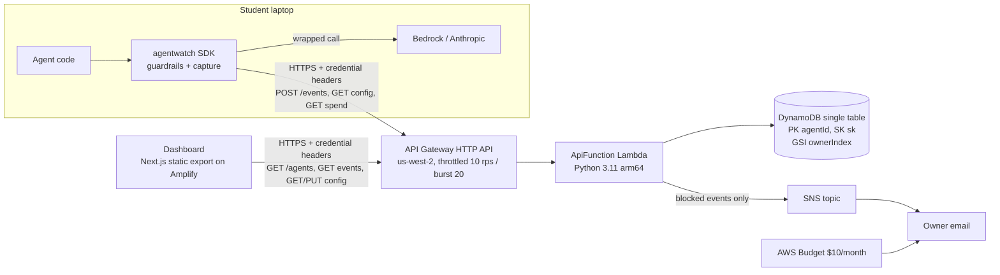
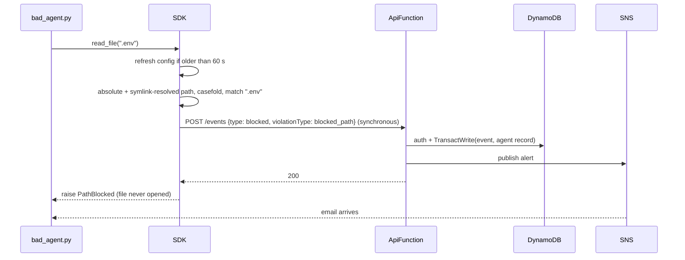

# Agent Watch architecture

Four parts. A Python SDK wraps the agent and enforces guardrails before an action runs. A serverless API (API Gateway HTTP API plus one Lambda) stores events, computes cost, and owns guardrail config. One DynamoDB table holds everything. A static Next.js dashboard reads and edits it. When a blocked event arrives, the API publishes an SNS email. The full spec is in `.kiro/specs/agent-watch/design.md`.

## The demo moment: `.env` blocked

The spend cap follows the same shape. Before every LLM call, the SDK checks local 24h spend plus a worst-case estimate for the pending call against the cap. If that's over, it sends a `spend_cap` blocked event and raises `SpendCapExceeded` without calling the provider.

## API

All routes require `x-agentwatch-owner` and `x-agentwatch-key-hash`. Missing or malformed headers return 401, and a key that doesn't match the agent's record returns 403.

| Route | Purpose |
| --- | --- |
| `POST /events` | Ingest one event. Registers the agent on first contact, computes cost server-side, and alerts on blocked events |
| `GET /agents` | Inventory for this owner and key |
| `GET /agents/{agentId}/events` | Timeline, paginated, filterable by type |
| `GET /agents/{agentId}/config` | Guardrail config plus the pricing table (the SDK uses this) |
| `PUT /agents/{agentId}/config` | Replace guardrail config (the dashboard uses this) |
| `GET /agents/{agentId}/spend` | Rolling 24h spend (the SDK uses this) |

The Lambda handler is a thin router. Validation, auth, and business logic live in plain modules (`service.py`, `store.py`, `rules.py`, `validation.py`, `pricing.py`, `alerts.py`) that take a store, a publisher, and a clock, so every rule is unit-tested without AWS.

## Data model (one table)

| Item | PK `agentId` | SK `sk` | Notes |
| --- | --- | --- | --- |
| Agent record | agent id | `META` | ownerId, key verifier, guardrail config, model, first/last seen, `totalSpendUsd`, `gsiOwnerId` |
| Event | agent id | `{ts}#{eventId}` | Fixed-width UTC `ts`, so string order is time order |

`ownerIndex` is a sparse GSI on `gsiOwnerId`. Only agent records carry that attribute, so the inventory query never reads events.

## Key decisions

| Decision | Choice | Why |
| --- | --- | --- |
| Where guardrails run | In the SDK, before the call or tool runs | No proxy hop or extra infra, and the provider key never leaves the student's machine. The cost is that it only covers wrapped calls (see README "Known limitations") |
| Who computes cost | The server, from one pricing table. The SDK gets the same table in the config response | A buggy client can't under-report stored spend, and local cap checks use the same numbers |
| Credentials | Client sends `sha256(api_key)`. Server stores `sha256(key_hash)` and compares with `hmac.compare_digest` | A database leak exposes only verifiers, never a usable key. Real user auth is a next step |
| Event write | One `TransactWriteItems`: conditional event put plus `ADD totalSpendUsd` on the agent record, conditioned on the key verifier | Retries can't double-count. A wrong key writes nothing. Event and total succeed or fail together |
| Registration | Conditional put `attribute_not_exists(sk)`. If it loses the race, re-read the record | Exactly one owner per agent id, with no locks |
| Path matching | Absolute and symlink-resolved forms, NFC plus casefold, name entries match any component, directory entries match by prefix and inode | Catches `.ENV`, `x/.env`, and a symlink alias. Every extra form can only add blocks |
| Alerts | SNS publish right after a newly stored blocked event | Simple and at-most-once. DynamoDB Streams would make it reliable (a next step) |
| Abuse and cost limits | Stage throttling 10 rps / burst 20, plus a $10 monthly AWS Budget email | Throttled requests get 429 at the edge and never invoke Lambda. Budgets is global, so it works from us-west-2 |
| Dashboard | Next.js 14 static export on Amplify. All data is fetched client-side. The browser stores only `{ownerId, keyHash}` | No server runtime to host or secure. CORS allows only the Amplify origin |
| Tests | pytest + Hypothesis (29 design properties), vitest + Testing Library, no AWS or network | Fast, credential-free runs. The live stack is checked by hand in rehearsal |
